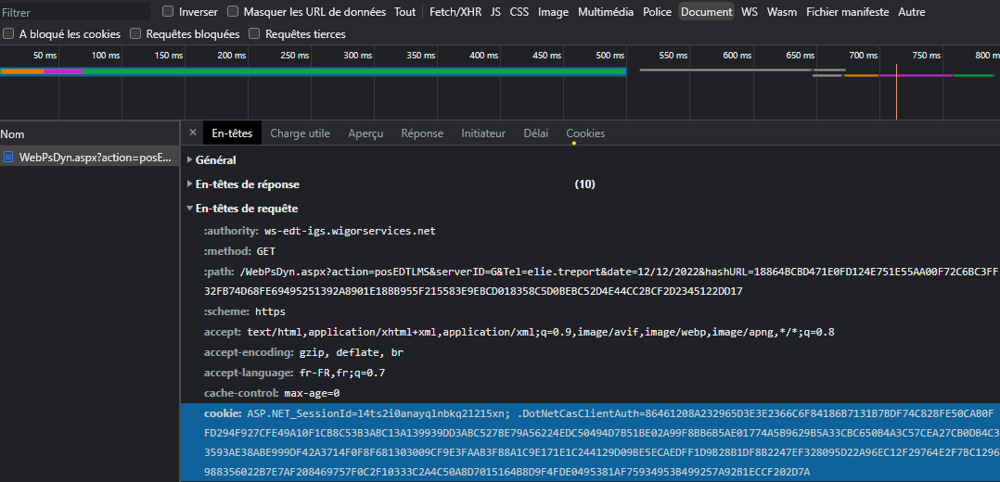

# How to run this program ?

1. Copy `env.example` and rename it `.env`
2. Log in to the IPI schedule
3. Copy the URL and add it into the `.env` file
4. Copy the content of **cookie** into `.env`

## Where to find the cookies

Go to the IPI schedule and do either:

- Right click and "Inspect"
- Press the F12 key

Then go to "Network" and click on the "Document" filter. Then click on the network request made and then go to "Headers" and copy the entire cookie value placed in "Request Headers".

Here is an example :

## Input

It is necessary to specify how far the program will scrape the data.

The month is an integer as is the year. The month must be defined in the interval [1,12] without 0 for months like January (01).

---

At the end of the program, a file in `.ics` format is created containing all the events to come.

> Specify the file path at this step, and the name of the file.

A file in this format can be integrated into any calendar (Google, Outlook, ...).